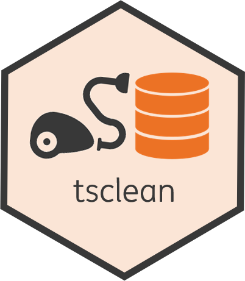
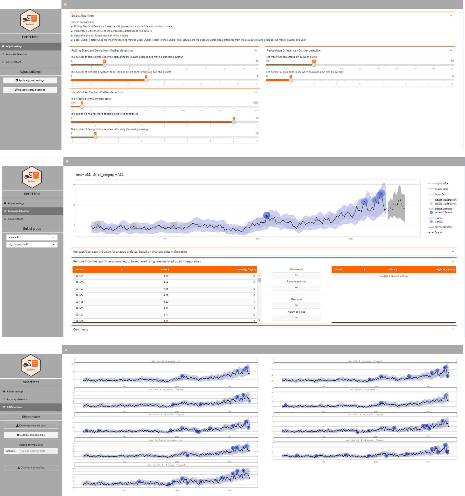
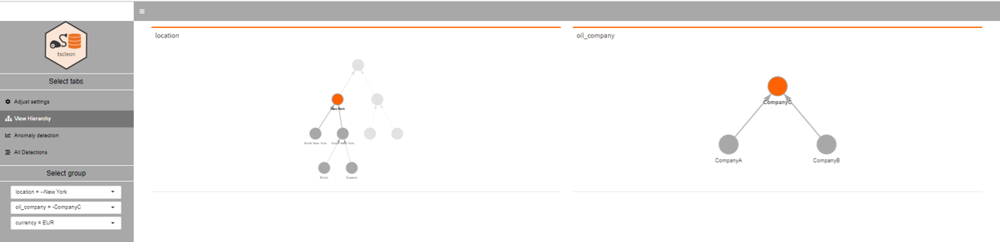

---
output:
  github_document:
    html_preview: false
---

<!-- README.md is generated from README.Rmd. Please edit that file -->

```{r, echo = FALSE}
knitr::opts_chunk$set(
  collapse = TRUE,
  comment = "#>",
  fig.path = "README-"
)
options(
  tibble.print_min = 5, 
  tibble.print_max = 5, 
  tibble.width = Inf
)
```

# 

[](https://www.tidyverse.org/lifecycle/#stable)

* [Overview](#overview)
* [Features](#features)
* [Installation](#installation)
* [How to use](#how_to_use)
* [Contribute](#contribute)
* [Acknowledgments](#acknowledgments)

## Overview<a name="overview"></a>

tsclean contains a set of R functions that support and start an interactive dashboard to enable the user to clean-up their time series data, using several anomaly detection algorithms to highlight potential anomalies to be replaced.

The original developers of this R package are [Gertjan van den Bos](mailto:gertjan.bos@ing.com), [Mehmet Kutluay](mailto:yasar.kutluay@ing.com), [Olle Dahlen](mailto:olle.dahlen@ing.com), [Miel Verkerken](mailto:mielverkerken@hotmail.com) & [Han Lin](mailto:han.lin@ing.com).


## Features<a name="features"></a>

The following main functions are available within this R package.

* Clean time series data:
    + `start_data_cleaning_dashboard()`<a name="start_data_cleaning_dashboard"></a>: is a wrapper function around several visualization functions to start a local Shiny dashboard to execute the cleaning of the available data. The following anomaly detection algorithms are available within the dashboard, using the following functions:
        - `detect_anomalies_using_local_outlier_factor()`<a name="detect_anomalies_using_local_outlier_factor"></a>: is a function to detect potential anomalies by using a machine learning technique called local outlier factor. The technique attempts to find anomalies based on the absolute percentage difference to the previous time steps moving average, as well as information on which month and quarter it is. The local outlier factor gives an anomaly score which is used to determine if a data point is considered a anomaly using a cut-off point.
        - `detect_anomalies_using_moving_standard_scores()`<a name="detect_anomalies_using_moving_standard_scores"></a>: is a function to detect potential anomalies by calculating a moving average and moving standard deviation, as input for the calculation of a standard score. Combined with a specified cut-off point this will flag individual points as potential anomalies.
        - `detect_anomalies_using_percent_differences()`<a name="detect_anomalies_using_percent_differences"></a>: is a function to detect potential anomalies by calculating a percentage difference of every point compared to the moving average at the previous timestep. Combined with a specified cut-off point this will flag individual points as potential anomalies.
        - `detect_anomalies_using_tsoutlier()`<a name="detect_anomalies_using_tsoutlier"></a>: is a function to detect potential anomalies using the [`tsoutliers()`](https://www.rdocumentation.org/packages/forecast/versions/8.4/topics/tsoutliers) function from the [forecast](https://cran.r-project.org/web/packages/forecast/forecast.pdf) package.

***

## Installation<a name="installation"></a>

tsclean is a package developed within ING and is not available on CRAN, but on [INGs github](https://github.com/ing-bank). 
You can install the package directly from github using the [devtools package](https://cran.r-project.org/web/packages/devtools/index.html), using:

```{r, eval = FALSE}
devtools::install_github("ing-bank/tsclean")
```

Some prerequisites for installing the package:

* R version 3.6.0 or later
* Rtools installed ([How to?](https://thecoatlessprofessor.com/programming/installing-rtools-for-compiled-code-via-rcpp))

Any required packages that are missing from your R library should be automatically installed for you, otherwise please [install any missing packages](https://stat.ethz.ch/R-manual/R-devel/library/utils/html/install.packages.html) before using the tsclean package.

***

## How to use<a name="how_to_use"></a>

The package contains a dummy anomaly dataset that can be used to try out the package:
```{r, eval = TRUE}
library(tsclean)
head(dummy_anomaly_data)
```

After getting your data, it has to be prepared for cleaning using the `initialize_ts_forecast_data()` function from the [tstools](github.com/ing-bank/tstools) package. For the example data available in `dummy_anomaly_data` this step has already been done.

```{r, eval = TRUE}
ts_data <- initialize_ts_forecast_data(
  data = dummy_anomaly_data,
  date_col = "period",
  col_of_interest = "col_of_interest"
)
head(ts_data)
```

With the data prepared, the data cleaning dashboard can now be started using the [`start_data_cleaning_dashboard()`](#start_data_cleaning_dashboard)) function. The example below uses the `dummy_anomaly_data` available in the package, but the `ts_data` can also be used if available.

```{r, eval = FALSE}
start_data_cleaning_dashboard(
  data = dummy_anomaly_data
)
```

The dashboard contains the following three views:

* **Adjust settings**: is where the anomaly detection algorithms to be used can be selected, as well as their tweakable parameters (if any) adjusted by the user.
* **Anomaly detection**: is where the detected potential anomalies are visualized and the user can decide which (if any) points to remove or adjust, for the selected group.
* **All Detections**: is where the all the available groups are visualized together, so that the user can quickly spot which groups still need (additional) cleaning. This view also enables the user to download/upload a set of identified anomalies (to continue cleaning later) and to download the cleaned data.



In case of hierarchical data, a fourth view is available:

* **View Hierarchy**: is where the hierarchical relationships between different groups are shown, for one or more group columns present within the data.



***

## Contribute<a name="contribute"></a>

- Idea? Please open an issue
- Bug? Please open an issue
- Want to contribute? Awesome! Please open an issue :)

## License<a name ="license"></a>

This package is free and open source software, licensed under GPL-3. More information can be found [here](https://www.gnu.org/licenses/gpl-3.0.en.html).

***

## Acknowledgments<a name="acknowledgments"></a>

This package relies on a number of other packages which implement different kinds of anomaly detection algorithms:

CRAN | Github | Background information 
------- | ------- | ------------------------------------------
[forecast](https://cran.r-project.org/web/packages/forecast/index.html) |  [robjhyndman](https://github.com/robjhyndman/forecast) | [Forecasting: principles and practice](https://www.otexts.org/book/fpp)
[DDoutlier](https://cran.r-project.org/web/packages/DDoutlier/index.html) | [jhmadsen](https://github.com/jhmadsen/ddoutlier) | [Local Outlier Factor for Anomaly Detection](https://towardsdatascience.com/local-outlier-factor-for-anomaly-detection-cc0c770d2ebe)
